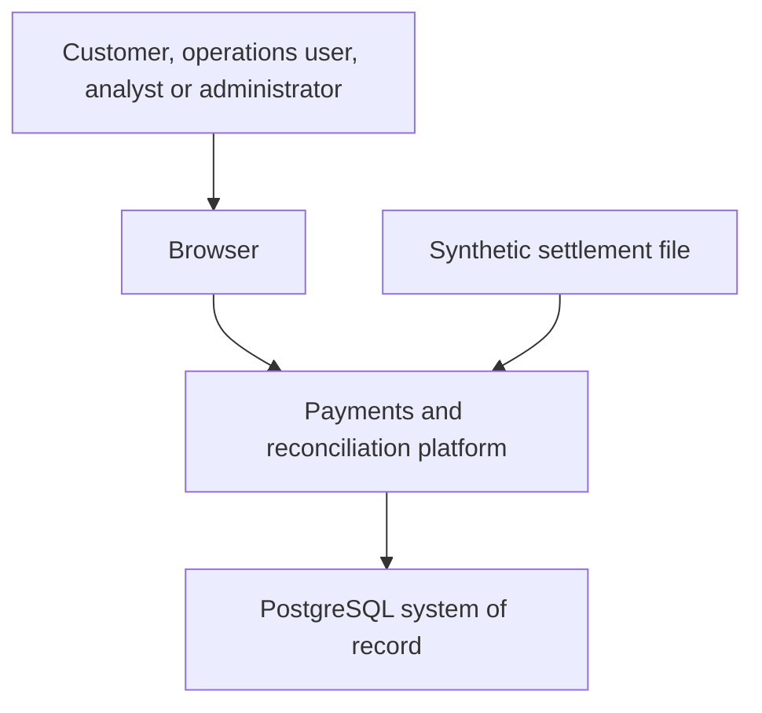
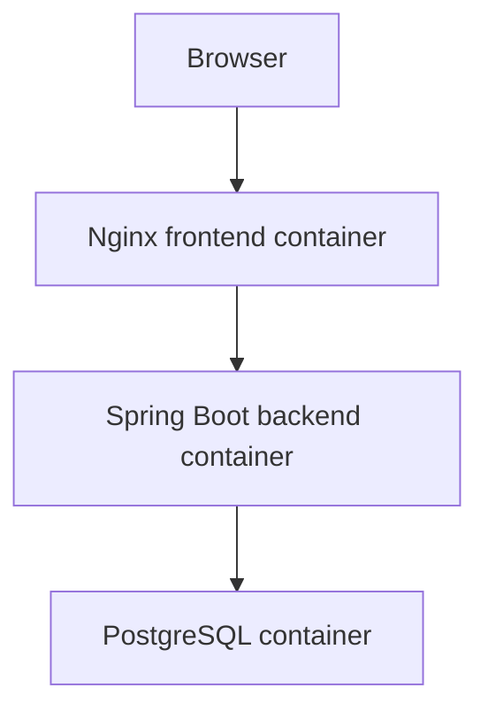
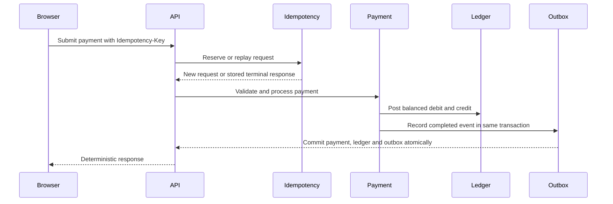
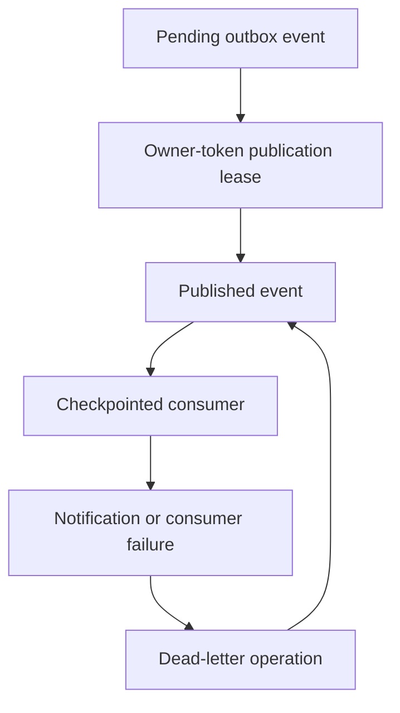
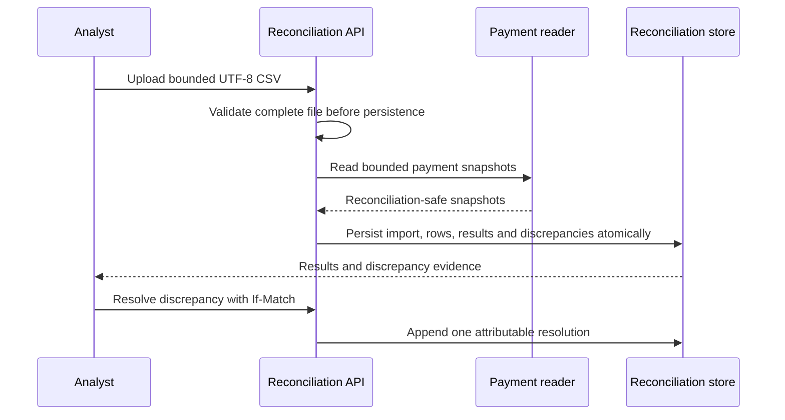
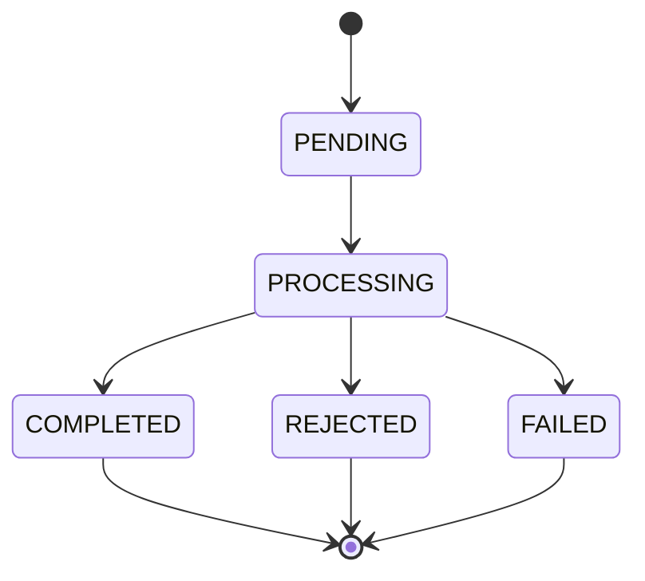

# Architecture diagrams

These diagrams describe the portfolio system at the level needed for review and interview discussion. They complement the detailed implementation notes in the repository README and architecture overview.

## System context

The platform is an educational simulation. It does not connect to a bank, card scheme, clearing system or external payment processor.

## Release containers

Nginx serves the React build and proxies `/api/` requests to the backend. PostgreSQL health gates backend startup in the release composition. The containers run as unprivileged users.

## Payment submission and outbox boundary

The outbox event is created inside the financial transaction. Publication happens later, so an event cannot be successfully published for a payment whose transaction did not commit.

## Publication and consumer reliability

Publication and notification delivery are at-least-once workflows. Unique source-event identifiers and durable checkpoints prevent a repeated delivery from creating a duplicate notification side effect.

## Settlement reconciliation

Reconciliation never mutates payment, account, ledger or outbox history. A later authorised financial correction would need to be represented by an explicit compensating transaction.

## Payment lifecycle

Idempotency and stale-processing recovery constrain how repeated submissions interact with this lifecycle. The original posted ledger history remains append-only.