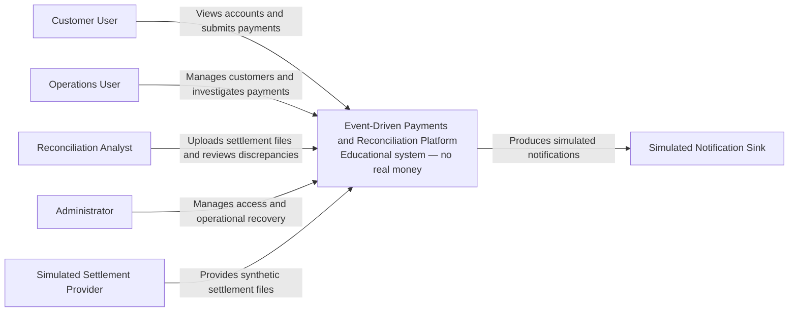
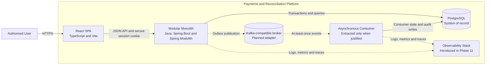
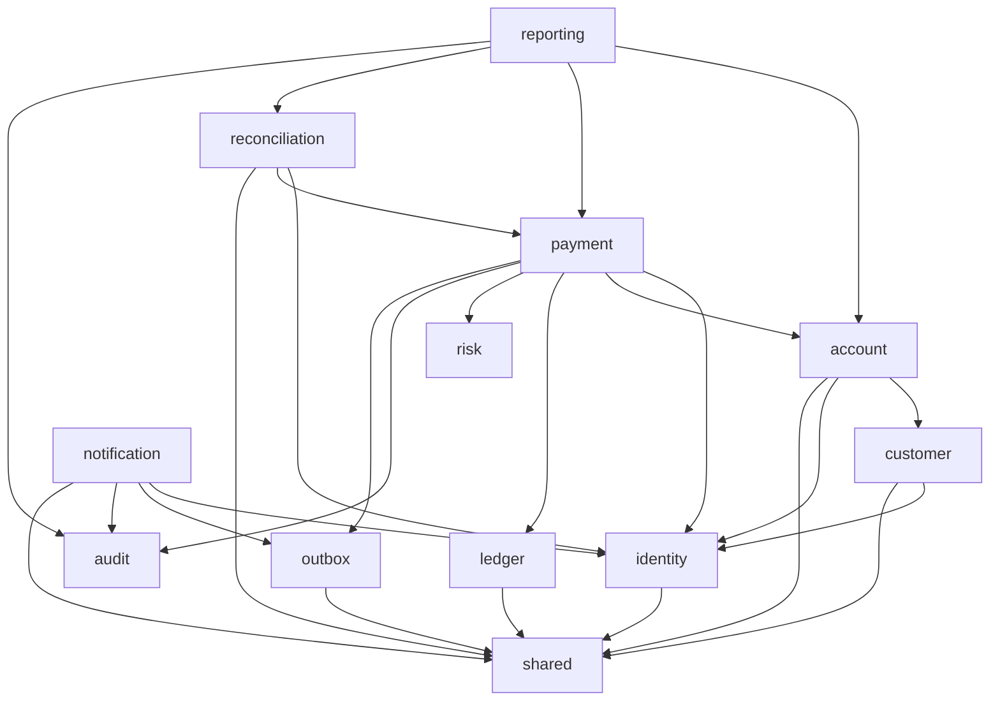
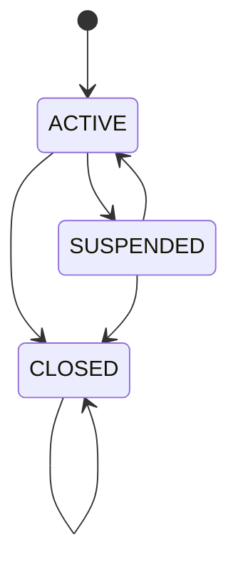
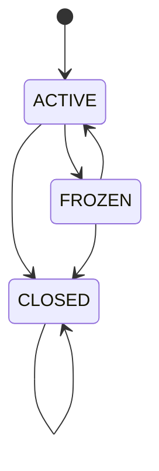

# Architecture overview

## Architectural style

The application begins as a modular monolith with a separately built browser
client.

The backend is one deployable Spring Boot process, but its business domains are
treated as independently owned modules.

Spring Modulith verifies declared module boundaries during automated testing.

Asynchronous infrastructure is introduced only when an implemented use case
requires durable asynchronous delivery.

## Implementation status

### Phase 1 — Executable platform foundation

Phase 1 established:

- the Spring Boot modular monolith;
- PostgreSQL and Flyway integration;
- the React and TypeScript browser client;
- the versioned system-information API;
- Actuator and OpenAPI;
- correlation-ID propagation;
- Testcontainers integration testing; and
- GitHub Actions verification.

### Phase 2 — Identity and access

Phase 2 implemented:

- persistent identity users and roles;
- normalised and uniquely constrained email addresses;
- password validation and BCrypt hashing;
- customer registration;
- Spring Security authentication;
- PostgreSQL-backed browser sessions;
- CSRF protection;
- failed-login tracking and temporary lockout;
- service-level role-based access control;
- administrator role management;
- session invalidation following role changes; and
- immutable role-change security audit events.

### Phase 3 — Customers and accounts

Phase 3 implemented:

- simulated customer profiles and lifecycle transitions;
- operations and administrator customer management;
- identity-to-customer ownership assignments;
- authenticated customer account views;
- GBP-only accounts using integer minor units;
- account lifecycle transitions and closure rules;
- database-enforced customer, account and ownership invariants;
- optimistic concurrency through entity versions, strong ETags and
  `If-Match`;
- strict JSON and identifier validation; and
- consistent security, validation and business-conflict problem responses.

### Phase 4 — Double-entry ledger

Phase 4 implemented:

- immutable ledger transaction headers and ordered entries;
- exact GBP minor-unit values with explicit debit and credit sides;
- application-level balanced-journal validation;
- atomic transaction-header and entry persistence;
- deferred PostgreSQL checks for entry count, both posting sides and balance;
- database-enforced append-only transaction and entry records;
- compensating-transaction links;
- deterministic transaction and account-history queries; and
- account snapshot verification against ledger totals.

### Phase 5 — Synchronous payments

Phase 5 implemented:

- authenticated internal GBP payment submission;
- source-account ownership through public identity, customer and account module
  boundaries;
- durable idempotency reservation, canonical request fingerprints and exact
  terminal response replay;
- processing leases and stale-request recovery;
- explicit payment lifecycle transitions and stable terminal reason codes;
- atomic account balance mutation, balanced ledger posting and payment
  completion;
- deterministic rejection without account or ledger mutation;
- bounded whole-transaction concurrency retry and durable failure finalisation;
- customer-owned payment lookup;
- privileged payment investigation for `OPERATIONS` and `ADMIN`; and
- HTTP, method-security, PostgreSQL and Spring Modulith verification.

### Phase 6 — Frontend payment experience

Phase 6 implemented:

- an authenticated React customer workspace over the existing server-side
  browser session;
- shared JSON and problem-response handling with runtime contract validation;
- in-memory CSRF handling for browser mutations;
- customer-scoped query caching and explicit session-expiry recovery;
- owned-account and exact GBP balance presentation;
- exact GBP text-to-minor-unit conversion without floating-point arithmetic;
- confirmation and retry-safe idempotent payment submission;
- bounded session-storage recovery for one unresolved payment request;
- completed, rejected, failed and in-progress outcome presentation;
- customer-owned payment lookup with privacy-preserving unavailable results; and
- accessible Vitest, Testing Library and MSW workflow verification.

ADR 0010 records the accepted scope, browser-security and interaction
decisions. The complete local Phase 6 verifier exercises the cumulative backend
and frontend regression gate.
### Phase 7 — Asynchronous events and outbox

Phase 7 implements:

- a project-owned outbox module and Flyway-managed PostgreSQL schema;
- a narrow `payment.completed.v1` event contract for successful internal
  payments;
- outbox creation inside the existing payment processing transaction;
- PostgreSQL JSON-object and bounded metadata validation;
- bounded `FOR UPDATE SKIP LOCKED` claiming with owner tokens and publication
  leases;
- simulated publication without requiring broker infrastructure;
- expired-lease recovery for at-least-once delivery;
- bounded exponential retry scheduling with deterministic jitter;
- dead-letter classification for permanent or exhausted failures; and
- focused domain, persistence, payment-atomicity and module verification.

ADR 0011 records the Phase 7 event contract, transaction boundary, claiming and
retry decisions.

Notification, reconciliation, reporting and full broker-backed consumer
capabilities are introduced in later phases. Phase 7 establishes the persisted
outbox boundary first. The observability stack is introduced incrementally in
Phase 11 without implying a production broker or deployment environment.
### Phase 8 — Notifications and dead letters

Phase 8 implements:

- a narrow public outbox reader for stable bounded published-event pages;
- Migration version 14 provides notification, checkpoint and consumer-failure
  persistence;
- a durable notification consumer checkpoint;
- unique source-event deduplication;
- structured `payment.completed.v1` schema-version-1 notification projection;
- inspectable terminal failures for invalid supported payloads;
- independent notification delivery attempts, owner-token leases and retries;
- customer-owned read-only notification queries and browser presentation;
- Migration version 15 provides outbox replay metadata and immutable audit;
- administrator-only outbox dead-letter inspection;
- controlled replay without payload mutation;
- optimistic version protection and immutable replay-audit evidence; and
- a role-gated React recovery interface with CSRF-protected replay.

Notification persistence and checkpoint advancement share one PostgreSQL
transaction. At-least-once publication remains visible: replay or lease recovery
may deliver the same source event again, while the notification source-event
constraint prevents a duplicate notification side effect.

The Phase 8 delivery sink remains simulated. Kafka-compatible transport, real
email or SMS providers, bulk replay and notification preferences remain outside
this phase.

ADR 0012 records the consumer, notification lifecycle, security and replay
decisions.

### Phase 9 — Settlement and reconciliation

Phase 9 implements:

- one exact UTF-8 settlement CSV contract with a 1 MiB raw-byte limit, between
  1 and 1,000 data rows, bounded fields and real CSV quoting;
- rejection of malformed UTF-8, a UTF-8 BOM, NUL characters, invalid headers,
  malformed records, duplicate external record identifiers and invalid values
  before persistence begins;
- SHA-256 idempotency over the original accepted file bytes;
- immutable import rows identified by their original one-based data-row number;
- one immutable reconciliation result per imported row;
- a public payment batch reader that returns only identifier, status, amount,
  currency, completion time and linked ledger-transaction identifier;
- deterministic discrepancy-code precedence;
- one database-protected accepted settlement match per payment;
- atomic import metadata, rows, results, discrepancies and final counts;
- analyst and administrator APIs with no-store responses and bounded keyset
  pagination;
- one-time discrepancy resolution using strong ETags and `If-Match`; and
- immutable resolution evidence containing actor identity, decision, bounded
  reason, discrepancy version and decision time.

The generic audit module remains reserved for Phase 10. Phase 9 resolution
evidence is owned by reconciliation and must not depend on identity-internal
security events or outbox-internal replay evidence.

ADR 0013 records the accepted import, matching, transaction, security and
resolution boundaries. Focused parser, matching, persistence, workflow,
authenticated HTTP, Spring Modulith and React tests verify the implementation.

### Phase 10 — Audit and operational reporting

Phase 10 implements:

- one canonical append-only journal for new business-audit event types;
- source-owned identity role-change, outbox replay and reconciliation
  resolution evidence exposed through narrow read-only module boundaries;
- one normalized audit projection without rewriting or duplicating historical
  source evidence;
- deterministic keyset audit search by time, category, type, actor, subject,
  correlation identifier and source;
- current and time-window payment, settlement and reconciliation summaries;
- bounded synchronous CSV exports containing typed, allow-listed fields;
- server-enforced audit and reporting visibility for `OPERATIONS`,
  `RECONCILIATION_ANALYST` and `ADMIN`; and
- a role-gated React workspace for audit search, operational summaries and
  report download.

Reporting remains read-only. It cannot update payments, accounts, ledger
records, outbox events, settlement evidence or source-owned audit evidence.
ADR 0014 records the event ownership, atomic recording, visibility, query,
aggregation and export boundaries. Focused domain, PostgreSQL, authenticated
HTTP, CSV, Spring Modulith and React tests verify the implementation.

### Phase 11 — Observability and performance

Phase 11 is complete and merged into `main`. The first foundation batch
implements:

- ECS-compatible structured console logging through Spring Boot;
- allow-listed request completion events containing method, route, status and
  duration without request bodies or query strings;
- Prometheus-compatible Actuator metrics;
- payment submission, completion, rejection, failure, replay, concurrency
  retry and processing-duration measurements; and
- liveness and database-aware readiness semantics.

Metrics and diagnostic endpoints are administrator-protected. The second
batch adds Micrometer/OpenTelemetry payment observations with configurable
OTLP export and a disabled-by-default administrator failure simulator. The
simulator is in-memory, bounded, excludes its own control endpoint, and can
target all HTTP requests, payment routes only, or a bounded delay. It does
not represent a production fault-injection system.

The Phase 11 load-test harness measures the authenticated payment submission
HTTP path with CSRF validation and unique idempotency keys. It accepts
short-lived fixture values from the environment and keeps credentials,
account identifiers and payment data out of source control. Its thresholds are
controlled run checks and do not constitute a production capacity or SLO claim.

ADR 0015 records the observability and performance boundaries.

### Phase 12 — Security hardening

Phase 12 adds source-owned defence-in-depth around the established session,
CSRF and role-based access model:

- explicit security headers for API responses, including `nosniff`, frame
  denial, restrictive referrer and permissions policies, an API CSP and
  HTTPS-only HSTS;
- a bounded in-memory fixed-window limiter for login, registration, payment
  and settlement-import writes, with `429` problem responses and
  `Retry-After` guidance;
- one-megabyte multipart file limits in addition to the settlement parser's
  strict raw-byte, UTF-8, field and row limits;
- allow-listed request-completion logging that excludes query strings, bodies,
  cookies, credentials and CSRF values;
- frontend preservation of rate-limit retry metadata; and
- a documented threat model, focused regression tests, a reproducible Phase 12
  verifier, GitHub dependency review and CodeQL analysis.

The limiter is deliberately single-process and keyed by the direct remote
address. It is not a cluster-wide control; a multi-instance deployment must
move the state to a shared store or trusted edge gateway. ADR 0016 and the
[Phase 12 threat model](security/threat-model.md) record the security scope and
residual risks.

## C4 context diagram

## C4 container diagram

Dashed relationships represent later phases and are not part of the initial
runtime.

## Backend module map

The diagram represents conceptual dependencies.

Phase 1 introduced declared module metadata and an automated Spring Modulith
verification test. Public module APIs and internal implementations will be
introduced with each domain capability.

## Module responsibilities

### Identity

Owns:

- users;
- credentials;
- roles;
- authentication;
- session-related application behaviour; and
- security audit events.

It does not own customer account balances.

### Customer

Owns:

- customer profiles;
- customer identifiers;
- customer lifecycle;
- identity-to-customer assignments; and
- customer eligibility for account creation.

### Account

Owns:

- customer accounts;
- account status;
- account balance snapshots;
- GBP currency enforcement; and
- optimistic versions.

### Payment

Owns:

- payment requests;
- payment state;
- payment orchestration;
- idempotency records; and
- payment-related events.

### Ledger

Owns:

- ledger transaction headers;
- ordered ledger entries referencing customer accounts;
- explicit debit and credit posting sides;
- compensating-transaction links;
- immutable posting history; and
- transaction, account-history and balance-verification queries.

### Outbox

Owns:

- durable integration-event records;
- versioned JSON payloads and event metadata;
- claim owner tokens and publication leases;
- publication attempts and retry schedules;
- successful publication timestamps;
- dead-letter classification;
- replay counters and last-replayed timestamps; and
- immutable administrator replay-audit evidence.

The outbox does not own payment state or ledger records. Payment code supplies a
public event request while the outbox owns persistence, publication lifecycle
and the narrow controlled-replay boundary.
### Risk

Owns deterministic payment-validation rules.

Version 1 does not claim to implement regulated fraud detection.

### Reconciliation

Owns:

- accepted settlement-import metadata and raw-byte SHA-256 fingerprints;
- immutable normalised settlement rows and external record identifiers;
- immutable per-row reconciliation results;
- the exclusive accepted-match claim for a payment;
- discrepancies and their optimistic lifecycle state; and
- immutable attributable discrepancy-resolution decisions.

It reads payment state only through a bounded public payment-module API and
uses the public identity boundary only to attribute mutations. It does not read
payment repositories, account internals, ledger internals, identity-internal
security events or outbox internals.

### Notification

Owns:

- durable projection of supported published events;
- consumer checkpoint and source-event deduplication;
- simulated notification delivery;
- notification attempts, leases and retry state;
- notification dead-letter state; and
- customer-owned notification queries.

The notification consumer depends on the public outbox event-reading boundary,
not outbox internals. It consumes only documented event contracts and does not
mutate payment, account or ledger records. Administrator orchestration invokes
the separate public outbox dead-letter operations boundary for eligible replay;
the notification module still cannot edit event payloads or outbox internals.

### Audit

Owns:

- the canonical append-only journal for new business-audit event types;
- versioned event names and allow-listed metadata schemas;
- actor, subject, source-record and correlation attribution;
- idempotent source-event keys for distinct business occurrences; and
- the public recording and bounded journal-reading boundaries.

The audit module does not take ownership of identity role-change events, outbox
replay evidence or reconciliation resolution evidence created before Phase 10.
Those records remain immutable in their source modules. No migration invents
historical canonical events or silently changes their meaning.

### Reporting

Owns:

- normalized read-only audit projections across canonical and source-owned
  evidence;
- operational payment, settlement and reconciliation summaries;
- deterministic filtering and bounded keyset pagination;
- bounded, formula-safe CSV report exports; and
- server-enforced visibility of audit categories and report families.

Reporting consumes only public module read models. It owns no business source
of truth and cannot mutate financial records, operational lifecycles or audit
evidence.

### Shared

Contains a deliberately small set of cross-cutting technical primitives such
as:

- identifiers;
- clock access;
- correlation metadata;
- API error structures; and
- supported currency primitives.

It must not become a generic dumping ground.

## Customer and account lifecycle

Customer profiles progress through explicit lifecycle operations:

Customer closure is terminal. Account creation requires an active customer.

Customer accounts use the following lifecycle:

Account closure is terminal and is rejected while the account has a non-zero
balance. Phase 5 adds a public account-module payment mutation boundary that
validates both accounts before atomically debiting the source and crediting the
destination inside the payment posting transaction.
Customer and account changes use optimistic concurrency. Read and successful
write responses provide a strong ETag derived from the persisted version.
Lifecycle and customer-name updates require a matching `If-Match` header.
Missing, malformed and stale preconditions return distinct problem responses.

## Strong consistency boundaries

The following operations use one PostgreSQL transaction.

### Ledger posting

A ledger posting transaction:

1. validates the transaction type, metadata and entry values;
2. verifies that at least two entries contain both debit and credit sides;
3. verifies exact equality of debit and credit minor-unit totals;
4. stores one immutable transaction header;
5. stores all ordered entries; and
6. passes the deferred PostgreSQL balance constraint at commit.

A persistence or deferred-constraint failure rolls back the header and every
entry together. Posted headers and entries cannot be updated or deleted.

### Payment reservation

A short reservation transaction creates one `PENDING` payment and one
`PROCESSING` idempotency record with a canonical request fingerprint, processing
owner token and five-minute lease. Existing keys either replay an exact terminal
response, reject a mismatched fingerprint, report active processing or allow
same-fingerprint lease recovery.

### Core payment posting

The processing owner executes one PostgreSQL transaction that:

1. verifies the idempotency reservation and owner token;
2. moves the payment from `PENDING` to `PROCESSING`;
3. validates ownership, account state, currency and available balance;
4. atomically debits the source and credits the destination account snapshot;
5. posts one balanced immutable ledger transaction;
6. attaches the ledger transaction to the payment;
7. moves the payment to `COMPLETED`;
8. writes one pending `payment.completed.v1` outbox event; and
9. stores the exact `201 Created` idempotent response.

A deterministic business refusal instead moves the payment to `REJECTED`,
changes no balance or ledger record and stores a replayable `422 Unprocessable
Content` response such as `PAYMENT_INSUFFICIENT_FUNDS`.

Unexpected failures roll back the core transaction and are finalised separately
as a bounded non-sensitive `FAILED` response. Retryable concurrency conflicts
restart the whole core transaction at most three total times.

The completed payment, account snapshots, ledger posting, terminal idempotent
response and outbox event commit atomically. An outbox constraint or persistence
failure rolls back the financial posting before the coordinator finalises the
payment as a bounded replayable failure in a separate transaction.

Rejected and failed payments do not create `payment.completed.v1` events.
### Role change

A role change transaction:

1. modifies the role assignment;
2. writes the associated immutable security audit event; and
3. invalidates active sessions for the affected user.

The role mutation and security event commit atomically.
### Settlement import and matching

After the entire bounded file has been parsed and validated, one PostgreSQL
transaction:

1. reserves the raw-byte fingerprint or returns the existing completed import;
2. stores import metadata and every normalised immutable row;
3. reads all referenced payments through one bounded public batch query;
4. classifies rows in original data-row order;
5. claims at most one accepted settlement match for each payment;
6. stores exactly one immutable result per row;
7. creates one discrepancy for every non-match; and
8. finalises immutable counts before commit.

A persistence, uniqueness or constraint failure rolls back the entire new
import. Concurrent otherwise-valid rows use a database uniqueness claim: the
first committed claim is `MATCHED`, and a later conflicting claim is
`DUPLICATE_PAYMENT_SETTLEMENT`. No two committed rows can both be the accepted
match for one payment.

### Discrepancy resolution

A discrepancy-resolution transaction:

1. locks and verifies the open discrepancy and expected version from
   `If-Match`;
2. inserts one immutable decision containing actor, decision, reason, prior
   version and timestamp; and
3. changes only the discrepancy status to `RESOLVED`.

It does not update a payment, account, ledger record, imported row,
reconciliation result or outbox event.

## Eventual consistency boundaries

The following may temporarily lag behind a committed payment:

- notification delivery;
- operational reporting projections;
- broker-delivery status;
- external settlement availability; and
- reconciliation results.

A delayed notification must never imply that a committed payment was lost.

## Payment and settlement separation

Payment processing and settlement reconciliation are separate state machines.

A payment can be completed internally while remaining unreconciled externally.
The payment module exposes a read-only reconciliation snapshot but accepts no
reconciliation commands.

Settlement imports, matching results, discrepancies and resolution decisions
cannot mutate or delete payment, account, ledger, imported-row, result or
outbox history.

A financial correction requires a separately authorised workflow that posts a
new compensating ledger transaction. Phase 9 records
`INTERNAL_CORRECTION_REQUIRED` but does not perform that correction.

## Persistence principles

### Implemented through Phase 9

- PostgreSQL is the application system of record.
- Flyway owns forward-only schema migration history.
- Hibernate schema generation is disabled.
- Migration version 1 establishes the baseline.
- Migration version 2 creates the identity schema.
- Migration version 3 creates the JDBC session schema.
- Migration version 4 creates the identity security-event log.
- Migration version 5 creates the customer profile schema.
- Migration version 6 creates the GBP customer account schema.
- Migration version 7 creates identity-to-customer assignments.
- Migration version 8 adds the remaining Phase 3 version invariant.
- Migration version 9 creates ledger transaction and entry tables.
- Migration version 10 adds deferred balance and immutability triggers.
- Migration version 11 creates payment and idempotency tables and constraints.
- Migration version 12 allows unknown payment account references to be recorded
  as deterministic business rejections.
- Migration version 13 creates the transactional outbox schema, lifecycle
  constraints and claiming indexes.
- Migration version 14 creates notification, checkpoint and consumer-failure
  persistence.
- Migration version 15 adds outbox replay metadata and immutable replay
  evidence.
- Migration version 16 creates settlement imports and immutable imported rows.
- Migration version 17 creates immutable reconciliation results, accepted
  payment-match claims and discrepancies.
- Migration version 18 creates immutable resolution evidence and the
  database-enforced one-time discrepancy lifecycle.
- Identity email uniqueness is protected by a database constraint.
- Browser sessions are stored in PostgreSQL.
- Role-change security events are append-only.
- A PostgreSQL trigger rejects updates and deletions of security-event rows.
- Customer, account and ownership versions cannot be negative.
- Customer and account statuses are database constrained.
- Account currency is constrained to GBP.
- Account balances cannot be negative.
- One identity can be assigned to no more than one customer.
- Ledger entries use positive `BIGINT` GBP minor-unit values.
- Every committed ledger transaction has at least two entries, contains debit
  and credit sides, and has equal debit and credit totals.
- Posted ledger transactions and entries are append-only.
- Ledger-derived account totals can be recalculated for snapshot verification.
- Payment and idempotency states, fingerprints, response sizes and ledger links
  are database constrained.
- Completed idempotency records retain exact bounded terminal responses for 24
  hours.
- Payment orchestration transactionally maintains account balance snapshots,
  ledger posting, payment state, the terminal idempotent response and one
  completed-payment outbox event.
- Outbox payloads are bounded JSON objects with database-constrained lifecycle
  metadata.
- Claimable events use an owner-token publication lease and PostgreSQL
  `FOR UPDATE SKIP LOCKED`.
- Published events retain their publication time; failed events retain bounded
  diagnostics and retry metadata.
- Database integration is tested with real PostgreSQL Testcontainers.

### Phase 9 persistence implementation

- Migration versions 16 through 18 separately own settlement imports and rows,
  reconciliation results and claims, and immutable resolution evidence.
- A unique lowercase SHA-256 fingerprint identifies one accepted raw file.
- External settlement record identifiers are globally unique across accepted
  imports.
- Imported rows and reconciliation results reject update and delete.
- Each imported row has exactly one result after an import commits.
- At most one result can hold the accepted match claim for a payment.
- Resolution decisions are append-only and unique per discrepancy.
- Financial schema changes continue to use forward-only Flyway migrations.

### Phase 10 persistence implementation

- Migration version 19 creates the canonical `business_audit_event` journal,
  event-specific metadata constraints, retry-safe source keys and database
  immutability controls.
- Migration version 20 adds deterministic normalized audit-search indexes to
  canonical and source-owned evidence tables.
- Migration version 21 adds bounded operational-reporting indexes for
  payments, completed settlement imports, discrepancies and resolutions.
- Canonical events use UUID identifiers, versioned event types, UTC instants,
  actor kind, optional actor identity, subject type and identifier, source
  module, source-record identity, a stable source-event identifier,
  correlation identifier and bounded JSON metadata.
- A unique source-event key makes recording retry safe.
- Event-specific metadata is allow-listed and schema-versioned; arbitrary
  request bodies, credentials, session identifiers, CSRF tokens, idempotency
  keys, raw settlement rows and event payloads are forbidden.
- Source-owned role-change, replay and resolution evidence is not copied or
  backfilled into the canonical journal.
- Reporting queries read canonical and source-owned records through public
  boundaries and return a normalized projection with an explicit source.
- Summary and export queries use read-only, repeatable-read PostgreSQL
  transactions so each response observes one snapshot and never persists
  derived financial state.

## API principles

### Implemented through Phase 9

- APIs are versioned under `/api/v1`.
- `GET /api/v1/system/info` exposes non-sensitive platform metadata.
- Correlation identifiers are propagated through `X-Correlation-ID`.
- Customer registration validates bounded email and password inputs.
- Authentication uses a server-side PostgreSQL session.
- State-changing browser requests require CSRF protection.
- Sensitive and security responses use `Cache-Control: no-store`.
- Role-management operations are authorised at the service boundary.
- Customer and account management requires `OPERATIONS` or `ADMIN`.
- Customer account views derive ownership from the authenticated identity.
- Anonymous protected requests return a structured `401 Unauthorized`
  problem response.
- Authenticated users without sufficient authority receive a structured
  `403 Forbidden` problem response.
- Customer and account request failures use stable problem codes.
- Unknown JSON fields are rejected.
- Malformed UUID path identifiers return deterministic problem responses.
- Customer and account reads return strong ETags.
- Conditional customer and account updates require `If-Match`.
- Stale writes return `412 Precondition Failed` without overwriting newer
  state.
- `POST /api/v1/payments` requires `CUSTOMER` authority and an
  `Idempotency-Key` header.
- Payment submission derives the actor from the authenticated session and never
  accepts a caller-supplied customer or actor identifier.
- Same-key same-request terminal replays return the exact stored status, media
  type and response body.
- Deterministic payment refusals return stable `422 Unprocessable Content`
  problem codes.
- Customers may read only payments they submitted through
  `GET /api/v1/payments/{paymentId}`.
- Foreign and missing payments are indistinguishable to customer callers.
- `OPERATIONS` and `ADMIN` may read any payment;
  `RECONCILIATION_ANALYST` may not.
- Payment responses use `Cache-Control: no-store`.
- Actuator exposes health, liveness and readiness.
- OpenAPI output is available under `/v3/api-docs`.

### Phase 9 reconciliation API

- Settlement and discrepancy operations require
  `RECONCILIATION_ANALYST` or `ADMIN` at the service boundary.
- Multipart upload accepts exactly one `file` part and enforces the raw-byte
  limit independently of caller-supplied metadata.
- Mutations use the existing session and CSRF controls.
- Import summaries, row results, discrepancy queues and details use
  `Cache-Control: no-store`.
- Identical accepted bytes return the existing import without duplicate rows,
  results or discrepancies.
- A different file that reuses an accepted external record identifier returns a
  stable conflict.
- Import rows use row-number keyset pagination. Discrepancy queues use a stable
  creation-time and identifier cursor. Page sizes are capped at 100.
- Discrepancy detail responses expose a strong version ETag.
- Resolution requires one strong `If-Match`; stale versions return
  `412 Precondition Failed`.
- Validation and business failures use the established
  `application/problem+json` structure with stable codes and field paths.

### Phase 10 audit and reporting API

- `GET /api/v1/audit-events` returns a normalized audit page ordered by
  `(occurredAt DESC, eventId DESC)` with an opaque keyset cursor and a maximum
  page size of 100.
- Audit filters are conjunctive, bounded and allow-listed. Time windows use UTC
  half-open intervals `[from, to)`.
- `GET /api/v1/reports/operational-summary` returns typed payment, settlement
  and reconciliation aggregates for a required bounded time window.
- `GET /api/v1/reports/audit-events.csv`,
  `GET /api/v1/reports/payments.csv`,
  `GET /api/v1/reports/settlements.csv` and
  `GET /api/v1/reports/reconciliation.csv` require a time window no longer
  than 31 days and return at most 10,000 data rows.
- CSV uses a fixed schema, UTF-8, RFC 4180 quoting and CRLF records. Exported
  values are typed or enumerated and free-text evidence is excluded, preventing
  spreadsheet-formula injection.
- `ADMIN` can access every audit category and report family. `OPERATIONS` can
  access operational payment and account evidence and reports.
  `RECONCILIATION_ANALYST` can access settlement and reconciliation evidence
  and reports. `CUSTOMER` has no Phase 10 access.
- Visibility is applied in the service query before pagination, aggregation or
  export. A client-supplied filter cannot widen the caller's scope.
- Audit, summary and export responses use `Cache-Control: no-store`. Downloads
  use fixed safe filenames and `X-Content-Type-Options: nosniff`.
- These endpoints are read-only GET requests. They do not accept CSRF tokens or
  expose a mutation path.

## Initial risk register

| Risk | Consequence | Control |
|---|---|---|
| Ledger imbalance | Financial corruption | Domain checks, deferred trigger and invariant tests |
| Concurrent debit | Negative account balance | Optimistic locking and business-rule re-evaluation |
| Request replay | Duplicate payment | Idempotency key, fingerprint and unique constraint |
| Lost event | Missing downstream action | Transactional outbox |
| Duplicate event | Repeated side effect | Consumer deduplication |
| Invalid state change | Inconsistent payment lifecycle | Explicit state machine |
| Broken access control | Data disclosure or mutation | Service-level RBAC and ownership tests |
| Malicious import | Injection or resource exhaustion | Byte and row limits, strict CSV parsing and complete pre-persistence validation |
| Sensitive logging | Credential or data exposure | Allow-listed fields and redaction tests |
| Framework incompatibility | Build or runtime failure | Locked versions and compatibility tests |
| Premature distribution | Excessive operational complexity | Modular monolith and extraction criteria |
| Misleading claims | Portfolio credibility damage | Educational disclaimer and measured evidence |

## Planned documentation

The final documentation set will include:

- C4 context diagram;
- C4 container diagram;
- module diagram;
- entity-relationship diagram;
- payment-submission sequence diagram;
- outbox-publication sequence diagram;
- reconciliation sequence diagram;
- payment state machine;
- account state machine;
- consistency-boundary explanation;
- idempotency explanation;
- transactional-outbox explanation;
- API examples;
- threat model;
- performance methodology;
- measured performance results;
- documented limitations; and
- a five-minute interview demonstration.
