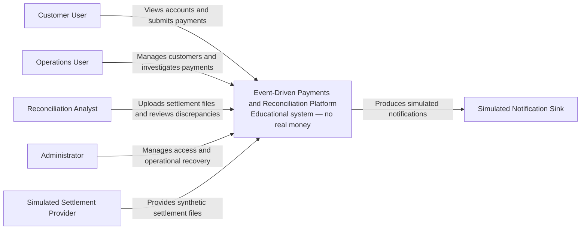
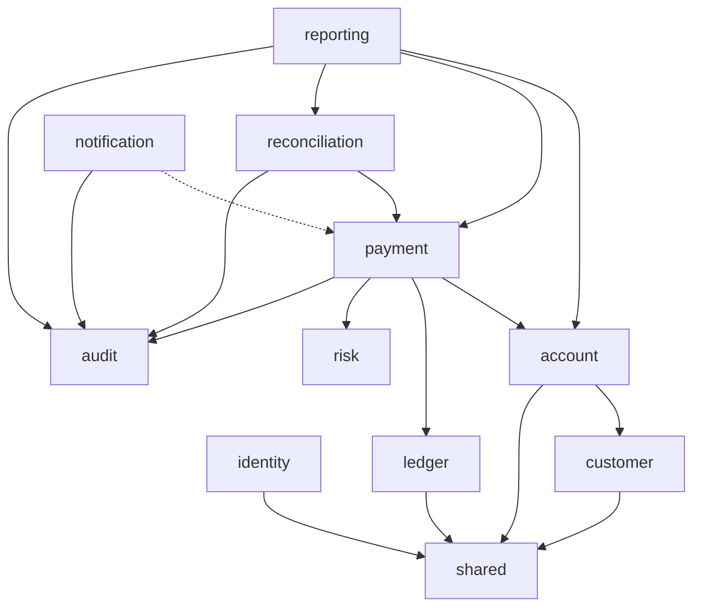

# Architecture overview

## Architectural style

The application begins as a modular monolith with a separately built browser
client.

The backend is one deployable Spring Boot process, but its business domains are
treated as independently owned modules.

Spring Modulith will verify module boundaries during automated testing.

Asynchronous infrastructure is introduced only when an implemented use case
requires durable asynchronous delivery.

## C4 context diagram

## C4 container diagram

Dashed relationships represent later phases and are not part of the initial
runtime.

## Backend module map

The diagram represents conceptual dependencies.

Executable architecture rules introduced in Phase 1 will distinguish public
module interfaces from internal implementations.

## Module responsibilities

### Identity

Owns:

- users;
- credentials;
- roles;
- authentication;
- session-related application behaviour; and
- security audit events.

It does not own customer account balances.

### Customer

Owns:

- customer profiles;
- customer identifiers; and
- customer lifecycle.

### Account

Owns:

- customer accounts;
- account ownership;
- account status;
- account balance snapshots; and
- optimistic versions.

### Payment

Owns:

- payment requests;
- payment state;
- payment orchestration;
- idempotency records; and
- payment-related events.

### Ledger

Owns:

- ledger accounts;
- ledger transaction headers;
- immutable debit entries;
- immutable credit entries; and
- balance-verification queries.

### Risk

Owns deterministic payment-validation rules.

Version 1 does not claim to implement regulated fraud detection.

### Reconciliation

Owns:

- settlement imports;
- imported settlement rows;
- reconciliation runs;
- matching results;
- discrepancies; and
- discrepancy resolution.

### Notification

Owns:

- simulated notification delivery;
- notification attempts;
- retry state; and
- consumer deduplication.

### Audit

Owns immutable business and security audit events.

### Reporting

Owns:

- operational read queries;
- dashboard projections; and
- demonstration report exports.

Reporting code cannot mutate financial records.

### Shared

Contains a deliberately small set of cross-cutting technical primitives such
as:

- identifiers;
- clock access;
- correlation metadata;
- API error structures; and
- supported currency primitives.

It must not become a generic dumping ground.

## Strong consistency boundaries

The following operations use one PostgreSQL transaction.

### Payment posting

The payment transaction will:

1. reserve or load the idempotency record;
2. validate the source and destination accounts;
3. validate the source balance;
4. progress the payment state;
5. create the ledger transaction;
6. create balanced ledger entries;
7. update account balance snapshots;
8. create the audit event;
9. create the outbox event; and
10. store the idempotent response.

If any required operation fails, the transaction rolls back.

### Role change

A role change transaction will:

1. modify role assignments; and
2. write the associated security audit event.

### Discrepancy resolution

A discrepancy-resolution transaction will:

1. update the resolution state; and
2. write the associated audit event.

## Eventual consistency boundaries

The following may temporarily lag behind a committed payment:

- notification delivery;
- operational reporting projections;
- broker-delivery status;
- external settlement availability; and
- reconciliation results.

A delayed notification must never imply that a committed payment was lost.

## Payment and settlement separation

Payment processing and settlement reconciliation are separate state machines.

A payment can be completed internally while remaining unreconciled externally.

A reconciliation discrepancy does not mutate or delete the original ledger
transaction.

A financial correction requires a new compensating ledger transaction.

## Persistence principles

- PostgreSQL is the system of record.
- Ledger entries are append-only.
- Audit events are append-only.
- Account balances are transactionally maintained snapshots.
- Ledger-derived balances can be recalculated for verification.
- Outbox records retain diagnostic and retry metadata.
- Imported files retain synthetic source identifiers and fingerprints.
- Database migrations are managed by Flyway.

## API principles

- APIs are versioned under `/api/v1`.
- Errors use `application/problem+json`.
- Field errors use stable property paths.
- Business conflicts use stable error codes.
- Pagination is bounded.
- Payment submission requires an `Idempotency-Key` header.
- Correlation identifiers are accepted or generated.
- The response returns the effective correlation identifier.
- Authentication uses a server-side session cookie.

## Initial risk register

| Risk | Consequence | Control |
|---|---|---|
| Ledger imbalance | Financial corruption | Domain checks, deferred trigger and invariant tests |
| Concurrent debit | Negative account balance | Optimistic locking and business-rule re-evaluation |
| Request replay | Duplicate payment | Idempotency key, fingerprint and unique constraint |
| Lost event | Missing downstream action | Transactional outbox |
| Duplicate event | Repeated side effect | Consumer deduplication |
| Invalid state change | Inconsistent payment lifecycle | Explicit state machine |
| Broken access control | Data disclosure or mutation | Service-level RBAC and ownership tests |
| Malicious import | Injection or resource exhaustion | Limits, streaming and strict parsing |
| Sensitive logging | Credential or data exposure | Allow-listed fields and redaction tests |
| Framework incompatibility | Build or runtime failure | Locked versions and compatibility tests |
| Premature distribution | Excessive operational complexity | Modular monolith and extraction criteria |
| Misleading claims | Portfolio credibility damage | Educational disclaimer and measured evidence |

## Planned documentation

The final documentation set will include:

- C4 context diagram;
- C4 container diagram;
- module diagram;
- entity-relationship diagram;
- payment-submission sequence diagram;
- outbox-publication sequence diagram;
- reconciliation sequence diagram;
- payment state machine;
- account state machine;
- consistency-boundary explanation;
- idempotency explanation;
- transactional-outbox explanation;
- API examples;
- threat model;
- performance methodology;
- measured performance results;
- documented limitations; and
- a five-minute interview demonstration.
