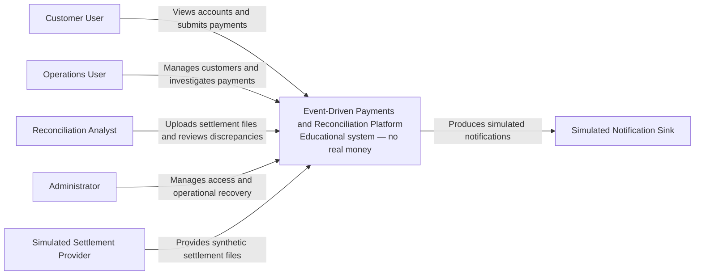
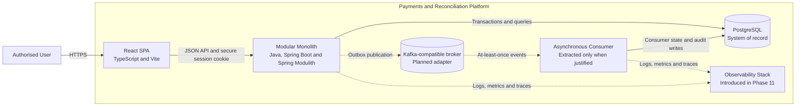
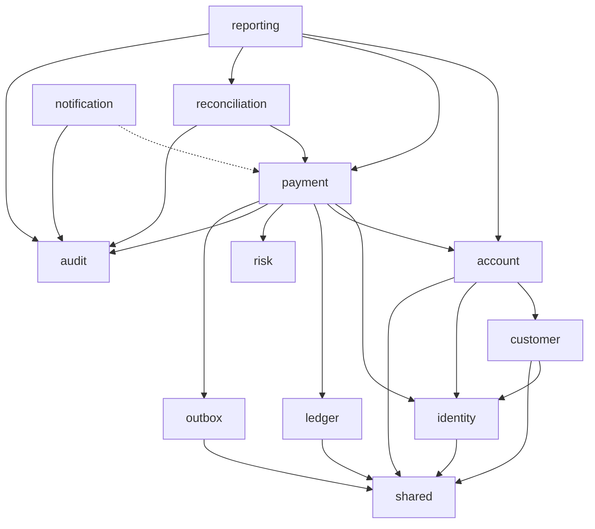
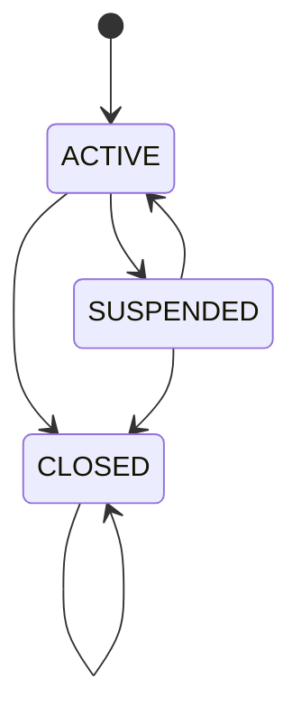
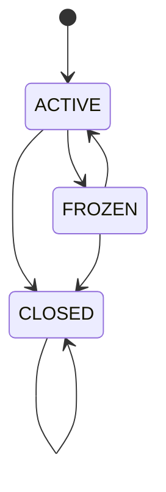

# Architecture overview

## Architectural style

The application begins as a modular monolith with a separately built browser
client.

The backend is one deployable Spring Boot process, but its business domains are
treated as independently owned modules.

Spring Modulith verifies declared module boundaries during automated testing.

Asynchronous infrastructure is introduced only when an implemented use case
requires durable asynchronous delivery.

## Implementation status

### Phase 1 — Executable platform foundation

Phase 1 established:

- the Spring Boot modular monolith;
- PostgreSQL and Flyway integration;
- the React and TypeScript browser client;
- the versioned system-information API;
- Actuator and OpenAPI;
- correlation-ID propagation;
- Testcontainers integration testing; and
- GitHub Actions verification.

### Phase 2 — Identity and access

Phase 2 implemented:

- persistent identity users and roles;
- normalised and uniquely constrained email addresses;
- password validation and BCrypt hashing;
- customer registration;
- Spring Security authentication;
- PostgreSQL-backed browser sessions;
- CSRF protection;
- failed-login tracking and temporary lockout;
- service-level role-based access control;
- administrator role management;
- session invalidation following role changes; and
- immutable role-change security audit events.

### Phase 3 — Customers and accounts

Phase 3 implemented:

- simulated customer profiles and lifecycle transitions;
- operations and administrator customer management;
- identity-to-customer ownership assignments;
- authenticated customer account views;
- GBP-only accounts using integer minor units;
- account lifecycle transitions and closure rules;
- database-enforced customer, account and ownership invariants;
- optimistic concurrency through entity versions, strong ETags and
  `If-Match`;
- strict JSON and identifier validation; and
- consistent security, validation and business-conflict problem responses.

### Phase 4 — Double-entry ledger

Phase 4 implemented:

- immutable ledger transaction headers and ordered entries;
- exact GBP minor-unit values with explicit debit and credit sides;
- application-level balanced-journal validation;
- atomic transaction-header and entry persistence;
- deferred PostgreSQL checks for entry count, both posting sides and balance;
- database-enforced append-only transaction and entry records;
- compensating-transaction links;
- deterministic transaction and account-history queries; and
- account snapshot verification against ledger totals.

### Phase 5 — Synchronous payments

Phase 5 implemented:

- authenticated internal GBP payment submission;
- source-account ownership through public identity, customer and account module
  boundaries;
- durable idempotency reservation, canonical request fingerprints and exact
  terminal response replay;
- processing leases and stale-request recovery;
- explicit payment lifecycle transitions and stable terminal reason codes;
- atomic account balance mutation, balanced ledger posting and payment
  completion;
- deterministic rejection without account or ledger mutation;
- bounded whole-transaction concurrency retry and durable failure finalisation;
- customer-owned payment lookup;
- privileged payment investigation for `OPERATIONS` and `ADMIN`; and
- HTTP, method-security, PostgreSQL and Spring Modulith verification.

### Phase 6 — Frontend payment experience

Phase 6 implemented:

- an authenticated React customer workspace over the existing server-side
  browser session;
- shared JSON and problem-response handling with runtime contract validation;
- in-memory CSRF handling for browser mutations;
- customer-scoped query caching and explicit session-expiry recovery;
- owned-account and exact GBP balance presentation;
- exact GBP text-to-minor-unit conversion without floating-point arithmetic;
- confirmation and retry-safe idempotent payment submission;
- bounded session-storage recovery for one unresolved payment request;
- completed, rejected, failed and in-progress outcome presentation;
- customer-owned payment lookup with privacy-preserving unavailable results; and
- accessible Vitest, Testing Library and MSW workflow verification.

ADR 0010 records the accepted scope, browser-security and interaction
decisions. The complete local Phase 6 verifier exercises the cumulative backend
and frontend regression gate.
### Phase 7 — Asynchronous events and outbox

Phase 7 implements:

- a project-owned outbox module and Flyway-managed PostgreSQL schema;
- a narrow `payment.completed.v1` event contract for successful internal
  payments;
- outbox creation inside the existing payment processing transaction;
- PostgreSQL JSON-object and bounded metadata validation;
- bounded `FOR UPDATE SKIP LOCKED` claiming with owner tokens and publication
  leases;
- simulated publication without requiring broker infrastructure;
- expired-lease recovery for at-least-once delivery;
- bounded exponential retry scheduling with deterministic jitter;
- dead-letter classification for permanent or exhausted failures; and
- focused domain, persistence, payment-atomicity and module verification.

ADR 0011 records the Phase 7 event contract, transaction boundary, claiming and
retry decisions.

Notification, reconciliation, reporting and full broker-backed consumer
capabilities are introduced in later phases. Phase 7 establishes the persisted
outbox boundary first; the Kafka-compatible broker, extracted asynchronous
consumers and observability stack remain planned components.
## C4 context diagram

## C4 container diagram

Dashed relationships represent later phases and are not part of the initial
runtime.

## Backend module map

The diagram represents conceptual dependencies.

Phase 1 introduced declared module metadata and an automated Spring Modulith
verification test. Public module APIs and internal implementations will be
introduced with each domain capability.

## Module responsibilities

### Identity

Owns:

- users;
- credentials;
- roles;
- authentication;
- session-related application behaviour; and
- security audit events.

It does not own customer account balances.

### Customer

Owns:

- customer profiles;
- customer identifiers;
- customer lifecycle;
- identity-to-customer assignments; and
- customer eligibility for account creation.

### Account

Owns:

- customer accounts;
- account status;
- account balance snapshots;
- GBP currency enforcement; and
- optimistic versions.

### Payment

Owns:

- payment requests;
- payment state;
- payment orchestration;
- idempotency records; and
- payment-related events.

### Ledger

Owns:

- ledger transaction headers;
- ordered ledger entries referencing customer accounts;
- explicit debit and credit posting sides;
- compensating-transaction links;
- immutable posting history; and
- transaction, account-history and balance-verification queries.

### Outbox

Owns:

- durable integration-event records;
- versioned JSON payloads and event metadata;
- claim owner tokens and publication leases;
- publication attempts and retry schedules;
- successful publication timestamps; and
- dead-letter classification.

The outbox does not own payment state or ledger records. Payment code supplies a
public event request while the outbox owns persistence and delivery lifecycle.
### Risk

Owns deterministic payment-validation rules.

Version 1 does not claim to implement regulated fraud detection.

### Reconciliation

Owns:

- settlement imports;
- imported settlement rows;
- reconciliation runs;
- matching results;
- discrepancies; and
- discrepancy resolution.

### Notification

Owns:

- simulated notification delivery;
- notification attempts;
- retry state; and
- consumer deduplication.

### Audit

Owns immutable business and security audit events.

### Reporting

Owns:

- operational read queries;
- dashboard projections; and
- demonstration report exports.

Reporting code cannot mutate financial records.

### Shared

Contains a deliberately small set of cross-cutting technical primitives such
as:

- identifiers;
- clock access;
- correlation metadata;
- API error structures; and
- supported currency primitives.

It must not become a generic dumping ground.

## Customer and account lifecycle

Customer profiles progress through explicit lifecycle operations:

Customer closure is terminal. Account creation requires an active customer.

Customer accounts use the following lifecycle:

Account closure is terminal and is rejected while the account has a non-zero
balance. Phase 5 adds a public account-module payment mutation boundary that
validates both accounts before atomically debiting the source and crediting the
destination inside the payment posting transaction.
Customer and account changes use optimistic concurrency. Read and successful
write responses provide a strong ETag derived from the persisted version.
Lifecycle and customer-name updates require a matching `If-Match` header.
Missing, malformed and stale preconditions return distinct problem responses.

## Strong consistency boundaries

The following operations use one PostgreSQL transaction.

### Ledger posting

A ledger posting transaction:

1. validates the transaction type, metadata and entry values;
2. verifies that at least two entries contain both debit and credit sides;
3. verifies exact equality of debit and credit minor-unit totals;
4. stores one immutable transaction header;
5. stores all ordered entries; and
6. passes the deferred PostgreSQL balance constraint at commit.

A persistence or deferred-constraint failure rolls back the header and every
entry together. Posted headers and entries cannot be updated or deleted.

### Payment reservation

A short reservation transaction creates one `PENDING` payment and one
`PROCESSING` idempotency record with a canonical request fingerprint, processing
owner token and five-minute lease. Existing keys either replay an exact terminal
response, reject a mismatched fingerprint, report active processing or allow
same-fingerprint lease recovery.

### Core payment posting

The processing owner executes one PostgreSQL transaction that:

1. verifies the idempotency reservation and owner token;
2. moves the payment from `PENDING` to `PROCESSING`;
3. validates ownership, account state, currency and available balance;
4. atomically debits the source and credits the destination account snapshot;
5. posts one balanced immutable ledger transaction;
6. attaches the ledger transaction to the payment;
7. moves the payment to `COMPLETED`;
8. writes one pending `payment.completed.v1` outbox event; and
9. stores the exact `201 Created` idempotent response.

A deterministic business refusal instead moves the payment to `REJECTED`,
changes no balance or ledger record and stores a replayable `422 Unprocessable
Content` response such as `PAYMENT_INSUFFICIENT_FUNDS`.

Unexpected failures roll back the core transaction and are finalised separately
as a bounded non-sensitive `FAILED` response. Retryable concurrency conflicts
restart the whole core transaction at most three total times.

The completed payment, account snapshots, ledger posting, terminal idempotent
response and outbox event commit atomically. An outbox constraint or persistence
failure rolls back the financial posting before the coordinator finalises the
payment as a bounded replayable failure in a separate transaction.

Rejected and failed payments do not create `payment.completed.v1` events.
### Role change

A role change transaction:

1. modifies the role assignment;
2. writes the associated immutable security audit event; and
3. invalidates active sessions for the affected user.

The role mutation and security event commit atomically.
### Discrepancy resolution

A discrepancy-resolution transaction will:

1. update the resolution state; and
2. write the associated audit event.

## Eventual consistency boundaries

The following may temporarily lag behind a committed payment:

- notification delivery;
- operational reporting projections;
- broker-delivery status;
- external settlement availability; and
- reconciliation results.

A delayed notification must never imply that a committed payment was lost.

## Payment and settlement separation

Payment processing and settlement reconciliation are separate state machines.

A payment can be completed internally while remaining unreconciled externally.

A reconciliation discrepancy does not mutate or delete the original ledger
transaction.

A financial correction requires a new compensating ledger transaction.

## Persistence principles

### Implemented through Phase 7

- PostgreSQL is the application system of record.
- Flyway owns forward-only schema migration history.
- Hibernate schema generation is disabled.
- Migration version 1 establishes the baseline.
- Migration version 2 creates the identity schema.
- Migration version 3 creates the JDBC session schema.
- Migration version 4 creates the identity security-event log.
- Migration version 5 creates the customer profile schema.
- Migration version 6 creates the GBP customer account schema.
- Migration version 7 creates identity-to-customer assignments.
- Migration version 8 adds the remaining Phase 3 version invariant.
- Migration version 9 creates ledger transaction and entry tables.
- Migration version 10 adds deferred balance and immutability triggers.
- Migration version 11 creates payment and idempotency tables and constraints.
- Migration version 12 allows unknown payment account references to be recorded
  as deterministic business rejections.
- Migration version 13 creates the transactional outbox schema, lifecycle
  constraints and claiming indexes.
- Identity email uniqueness is protected by a database constraint.
- Browser sessions are stored in PostgreSQL.
- Role-change security events are append-only.
- A PostgreSQL trigger rejects updates and deletions of security-event rows.
- Customer, account and ownership versions cannot be negative.
- Customer and account statuses are database constrained.
- Account currency is constrained to GBP.
- Account balances cannot be negative.
- One identity can be assigned to no more than one customer.
- Ledger entries use positive `BIGINT` GBP minor-unit values.
- Every committed ledger transaction has at least two entries, contains debit
  and credit sides, and has equal debit and credit totals.
- Posted ledger transactions and entries are append-only.
- Ledger-derived account totals can be recalculated for snapshot verification.
- Payment and idempotency states, fingerprints, response sizes and ledger links
  are database constrained.
- Completed idempotency records retain exact bounded terminal responses for 24
  hours.
- Payment orchestration transactionally maintains account balance snapshots,
  ledger posting, payment state, the terminal idempotent response and one
  completed-payment outbox event.
- Outbox payloads are bounded JSON objects with database-constrained lifecycle
  metadata.
- Claimable events use an owner-token publication lease and PostgreSQL
  `FOR UPDATE SKIP LOCKED`.
- Published events retain their publication time; failed events retain bounded
  diagnostics and retry metadata.
- Database integration is tested with real PostgreSQL Testcontainers.

### Planned domain persistence guarantees

- Imported files retain synthetic source identifiers and fingerprints.
- Financial schema changes use forward-only Flyway migrations.
## API principles

### Implemented through Phase 5

- APIs are versioned under `/api/v1`.
- `GET /api/v1/system/info` exposes non-sensitive platform metadata.
- Correlation identifiers are propagated through `X-Correlation-ID`.
- Customer registration validates bounded email and password inputs.
- Authentication uses a server-side PostgreSQL session.
- State-changing browser requests require CSRF protection.
- Sensitive and security responses use `Cache-Control: no-store`.
- Role-management operations are authorised at the service boundary.
- Customer and account management requires `OPERATIONS` or `ADMIN`.
- Customer account views derive ownership from the authenticated identity.
- Anonymous protected requests return a structured `401 Unauthorized`
  problem response.
- Authenticated users without sufficient authority receive a structured
  `403 Forbidden` problem response.
- Customer and account request failures use stable problem codes.
- Unknown JSON fields are rejected.
- Malformed UUID path identifiers return deterministic problem responses.
- Customer and account reads return strong ETags.
- Conditional customer and account updates require `If-Match`.
- Stale writes return `412 Precondition Failed` without overwriting newer
  state.
- `POST /api/v1/payments` requires `CUSTOMER` authority and an
  `Idempotency-Key` header.
- Payment submission derives the actor from the authenticated session and never
  accepts a caller-supplied customer or actor identifier.
- Same-key same-request terminal replays return the exact stored status, media
  type and response body.
- Deterministic payment refusals return stable `422 Unprocessable Content`
  problem codes.
- Customers may read only payments they submitted through
  `GET /api/v1/payments/{paymentId}`.
- Foreign and missing payments are indistinguishable to customer callers.
- `OPERATIONS` and `ADMIN` may read any payment;
  `RECONCILIATION_ANALYST` may not.
- Payment responses use `Cache-Control: no-store`.
- Actuator exposes health, liveness and readiness.
- OpenAPI output is available under `/v3/api-docs`.

### Planned API guarantees

- Remaining future APIs use the established
  `application/problem+json` structure.
- Field errors use stable property paths.
- Business conflicts use stable machine-readable codes.
- Pagination is bounded where collection endpoints require it.
## Initial risk register

| Risk | Consequence | Control |
|---|---|---|
| Ledger imbalance | Financial corruption | Domain checks, deferred trigger and invariant tests |
| Concurrent debit | Negative account balance | Optimistic locking and business-rule re-evaluation |
| Request replay | Duplicate payment | Idempotency key, fingerprint and unique constraint |
| Lost event | Missing downstream action | Transactional outbox |
| Duplicate event | Repeated side effect | Consumer deduplication |
| Invalid state change | Inconsistent payment lifecycle | Explicit state machine |
| Broken access control | Data disclosure or mutation | Service-level RBAC and ownership tests |
| Malicious import | Injection or resource exhaustion | Limits, streaming and strict parsing |
| Sensitive logging | Credential or data exposure | Allow-listed fields and redaction tests |
| Framework incompatibility | Build or runtime failure | Locked versions and compatibility tests |
| Premature distribution | Excessive operational complexity | Modular monolith and extraction criteria |
| Misleading claims | Portfolio credibility damage | Educational disclaimer and measured evidence |

## Planned documentation

The final documentation set will include:

- C4 context diagram;
- C4 container diagram;
- module diagram;
- entity-relationship diagram;
- payment-submission sequence diagram;
- outbox-publication sequence diagram;
- reconciliation sequence diagram;
- payment state machine;
- account state machine;
- consistency-boundary explanation;
- idempotency explanation;
- transactional-outbox explanation;
- API examples;
- threat model;
- performance methodology;
- measured performance results;
- documented limitations; and
- a five-minute interview demonstration.
